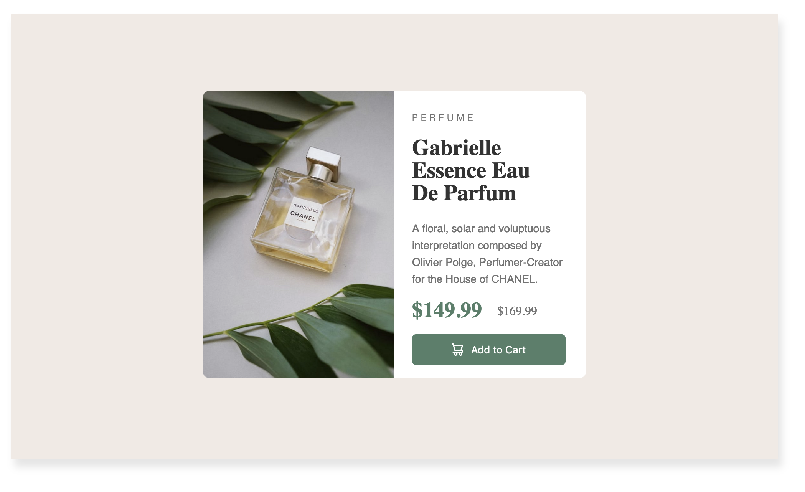
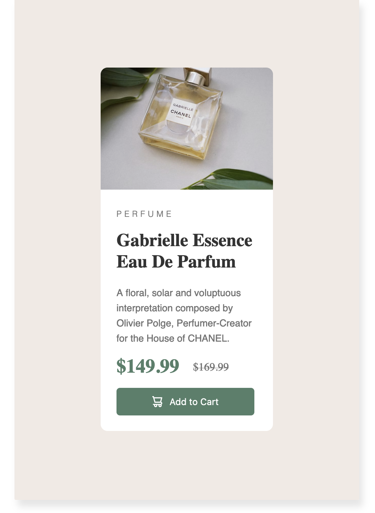

# Frontend Mentor - Product preview card component solution

This is a solution to the [Product preview card component challenge on Frontend Mentor](https://www.frontendmentor.io/challenges/product-preview-card-component-GO7UmttRfa). Frontend Mentor challenges help you improve your coding skills by building realistic projects. 

## Table of contents

- [Overview](#overview)
  - [The challenge](#the-challenge)
  - [Screenshot](#screenshot)
  - [Links](#links)
- [My process](#my-process)
  - [Built with](#built-with)
  - [What I thought](#what-i-thought)
- [Author](#author)

**Note: Delete this note and update the table of contents based on what sections you keep.**

## Overview

### The challenge

Users should be able to:

- View the optimal layout depending on their device's screen size
- See hover and focus states for interactive elements

### Screenshot

### Links

- Solution URL: [https://github.com/lalysi/product-preview-card](https://github.com/lalysi/product-preview-card)
- Live Site URL: [https://lalysi.github.io/product-preview-card/](https://lalysi.github.io/product-preview-card/)

## My process

I built this by creating the desktop version and then adding in a media query for smaller/mobile devices.

### Built with

- Semantic HTML5 markup
- CSS custom properties
- Flexbox

**Note: These are just examples. Delete this note and replace the list above with your own choices**

### What I thought

This was a great quick project to refresh html and css skills.

## Author

- Twitter - [@lalysi1](https://www.twitter.com/lalysi1)

**Note: Delete this note and add/remove/edit lines above based on what links you'd like to share.**

